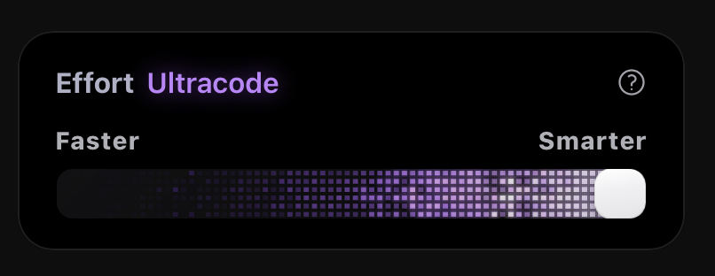

# 复刻Claudecode的范围滑块



## 目录结构

```
effort-card/
├── EffortCard.vue              # 主组件，负责 UI 布局和样式
├── composables/
│   ├── useSliderState.js       # 滑块业务状态（值、标签、动画）
│   └── useWebglFire.js         # WebGL 引擎（context、FBO、渲染循环）
├── shaders/
│   └── index.js                # 全部 GLSL 源码（顶点 + 三段片段着色器）
└── README.md
```

## 文件说明

### `EffortCard.vue`

主组件，只负责**模板和样式**，不含任何 WebGL 逻辑。

- 渲染 SVG squircle 裁剪路径（卡片和滑轨各一个）
- 布局 header、状态标签、滑轨、滑块
- 调用两个 composable 获取状态和引擎
- CSS 包含所有视觉细节：滑块阴影、glow 效果、翻转动画、Firefox 兼容样式

### `shaders/index.js`

纯数据文件，导出四个 GLSL 源码字符串：

| 导出 | 类型 | 用途 |
|---|---|---|
| `VERT` | 顶点着色器 | 全屏三角形，输出 UV 坐标 |
| `FRAG_SIM` | 片段着色器 | 火焰模拟：细胞网格、衰减、火花、边缘光 |
| `FRAG_BLUR` | 片段着色器 | 7-tap 高斯模糊（水平/垂直复用，用 uniform 区分方向） |
| `FRAG_COMP` | 片段着色器 | 将场景和 glow 贴图做色调映射合成 |

### `composables/useSliderState.js`

纯业务逻辑，**无 DOM 依赖**，可独立单元测试。

**返回值：**

| 字段 | 类型 | 说明 |
|---|---|---|
| `sliderValue` | `Ref<number>` | 当前滑块值 (0–100) |
| `isActive` | `ComputedRef<boolean>` | 是否到达 Ultracode 阈值 (>= 100) |
| `isFull` | `ComputedRef<boolean>` | 是否恰好 100 |
| `isAnimating` | `Ref<boolean>` | 翻转动画是否正在播放 |
| `statusLabel` | `ComputedRef<string>` | 状态文本：Low / Medium / High / Ultracode |
| `onInput` | `(e) => void` | 滑块 input 事件处理器 |

**内部行为：**
- 监听 `statusLabel` 变化，进入/退出 Ultracode 时触发 CSS 翻转动画
- 组件卸载时自动清理 timer

### `composables/useWebglFire.js`

WebGL2 渲染引擎，封装了完整的生命周期管理。

**参数：**

| 参数 | 类型 | 说明 |
|---|---|---|
| `canvasRef` | `Ref<HTMLCanvasElement>` | canvas 元素引用 |
| `sliderValue` | `Ref<number>` | 滑块值（驱动火焰位置） |
| `isActive` | `Ref<boolean>` | 是否处于 Ultracode 模式（驱动渲染循环启停） |

**内部职责：**

1. **初始化** — `onMounted` 时获取 WebGL2 context，编译链接 shader program，创建 VAO/VBO
2. **尺寸管理** — `ResizeObserver` 监听 canvas 尺寸变化，自动重建 FBO
3. **渲染循环** — 4-pass 管线：
   - Pass 1：火焰模拟（写入 simB，读取上一帧 simA）
   - Pass 2：水平高斯模糊
   - Pass 3：垂直高斯模糊
   - Pass 4：色调映射合成到屏幕
4. **性能优化** — 内部缓存 reactive 值（`cachedActive` / `cachedSlider`），渲染循环不触发 Vue 依赖追踪；闲置 180 帧后自动停止 rAF
5. **资源释放** — `onBeforeUnmount` 时销毁所有 FBO、program、VAO、VBO，移除事件监听
6. **Context 恢复** — `webglcontextrestored` 时重建资源而非刷新页面

## 关键设计决策

| 决策 | 原因 |
|---|---|
| canvas 用 `opacity: 0` 而非 `display: none` | Chrome 下隐藏 canvas 的 WebGL context 可能休眠或尺寸为 0 |
| watcher 用 `{ flush: 'post' }` | 确保 CSS 类已应用、DOM 已更新后再初始化 canvas 尺寸 |
| 渲染循环读缓存值而非 `.value` | 每帧两次 reactive 追踪有开销，热路径应避免 |
| `ResizeObserver` 替代 rAF 轮询 | 更可靠地检测尺寸变化，自带 debounce |
| shader 独立文件 | 编辑器语法高亮、可复用、主文件更干净 |

## 依赖

- Vue 3.3+
- WebGL2（所有现代浏览器均支持）